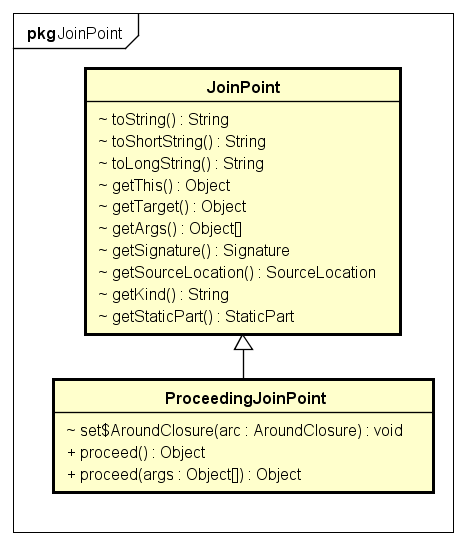

# 1 AOP
AOP (Aspect-Oriented Programming) 面向切面编程是OOP (Object-Oriented Programming)之外的另外一种编程思想。OOP编程的核心是类，而AOP编程的核心的切面，关注的是跨越多个类或对象的横切逻辑。  
AOP是Spring框架的重要组成，但IOC容器并不依赖它，可以把它当做一种功能强大的中间件使用。  
AOP在Spring中可以提供声明式的企业级服务用来代替EJB，例如最常见的声明式事务管理；此外还允许用户自定义切面来实现更多的功能。  

## 1.1 基本概念
- Join point: 程序执行中特定位置。例如方法执行前、执行后、抛出异常时等。  
- Advice：增强。在特定的连接点植入的额外程序逻辑，一般可以分为前置增强、后置增强、环绕增强等。技术实现上，一般采用拦截器链来实现。  
- Pointcut：切点。满足一定条件的连接点。Advice中包含了切点表达式，作用在满足该表达式的连接点上。Spring默认使用AspectJ 切点表达式。  
- Introduction：引介。为目标对象新增额外的属性或方法。  
- Aspect：切面。切面由Pointcut和Advice增强组成，既包括了横切逻辑的定义也包括了连接点的定义。Spring AOP的工作就是将（切面定义的）横切逻辑织入到（切面定义的）连接点中。  
- Target object：目标对象。被织入增强的普通对象。Spring AOP采用运行时代理，目标对象最终返回的是一个代理对象。  
- AOP proxy：AOP框架创建的目标对象的代理对象。一般基于JDK动态代理或CGLIB动态代理。  
- Weaving：将增强添加到目标对象指定连接点的过程。三种织入方式：编译期织入、类装载时织入、运行时织入。AspectJ采用的是编译期织入。  

增强类型：
- Before advice：前置增强。在目标方法执行前实施增强。  
- After returning advice：后置增强。在目标方法正确执行后实施增强。  
- After throwing advice：异常抛出增强。在目标方法抛出异常时实施增强。  
- After(finally) advice：finally增强。在目标方法执行后，不管是否抛出异常，实施增强。
- Around advice：环绕增强。在方法执行前和后实施增强。  

## 1.2 AOP的实现者
### 1.2.1 AspectJ
AspectJ是语言级的AOP实现，它扩展了Java语言，定义了AOP语法，能够在编译期提供横切代码的织入。所以它有一个专门的编译器用来生成遵守Java字节编码规范的Class文件。  
### 1.2.2 Spring AOP
Spring AOP使用纯Java实现，它不需要专门的编译过程，不需要特殊的类装载器，它在运行期通过代理方式向目标类织入增强代码，默认使用JDK动态代理技术，也支持CGLIB代理。Spring并不尝试提供最完整的AOP实现，相反，它侧重于提供一种和Spring IOC容器整合的AOP实现，用以解决企业级开发中的常见问题。在Spring中，我们可以无缝的将Spring AOP、IOC和AspectJ整合在一起。  

## 1.3 Spring AOP APIS
### 1.3.1 Advice 增强
Spring使用增强类定义横切逻辑。Spring只支持方法连接点，增强中包含了在方法的哪个点加入横切逻辑的方位信息。因此，Spring增强由横切逻辑和方法方位信息组成。  
按照增强作用在方法上的方位信息，增强可以分为以下5类：  
- 前置增强：在目标方法执行前实施增强。org.springframework.aop.BeforeAdvice代表前置增强，由于Spring目前只支持方法级别的增强，所以org.springframework.aop.MethodBeforeAdvice是目前可用的前置增强。  
- 后置增强：在目标方法执行后实施增强。org.springframework.aop.AfterReturningAdvice表示后置增强。  
- 环绕增强：在目标方法执行前和执行后实施增强。org.aopalliance.intercept.MethodInterceptor表示环绕增强。  
- 异常抛出增强：在目标方法抛出异常后实施增强。org.springframework.aop.ThrowsAdvice表示异常抛出增强。  
- 引介增强：在目标类中添加新的属性和方法。org.springframework.aop.IntroductionInterceptor表示引介增强。  


#### 1.3.1.1 前置增强
实现org.springframework.aop.MethodBeforeAdvice接口，添加前置增强逻辑。
```java
/**
* 自定义前置增强
*/
public class MyMethodBeforeAdvice implements MethodBeforeAdvice{
    @Override
    public void before(Method method, Object[] args, Object target) throws Throwable {
        System.out.println("MyBeforeAdvice>>" + target);
    }
}
```
```xml
<bean id="myBeforeAdvice"
		class="com.study.spring.core.aop.xml.advice.MyMethodBeforeAdvice" />

<bean id="barTarget" class="com.study.spring.core.aop.xml.BarServiceImpl" />
<bean id="barProxy" class="org.springframework.aop.framework.ProxyFactoryBean">
    <!-- 配置增强Bean的名称 -->
    <property name="interceptorNames" value="myBeforeAdvice" />
    <!-- 配置目标类 -->
    <property name="target" ref="barTarget" />
    <!-- 配置接口类，默认使用JDK动态代理 -->
    <property name="proxyInterfaces" value="com.study.spring.core.aop.xml.IBarService" />
    <!-- 强制使用cglib动态代理，下面配置二选一 -->
    <property name="proxyTargetClass" value="true" />
    <property name="optimize" value="true" />
</bean>
```
如上配置，自定义前置增强会实施到目标对象中的每个public方法上去。  

#### 1.3.1.2 后置增强
实现org.springframework.aop.AfterReturningAdvice接口，添加后置增强逻辑。当目标方法中有异常抛出时，后置增强将不会执行。  
#### 1.3.1.3 环绕增强
实现org.aopalliance.intercept.MethodInterceptor接口，添加环绕增强逻辑。需要在增强中主动调用目标方法：  
```java
public class MyMethodInterceptor implements MethodInterceptor {
    @Override
    public Object invoke(MethodInvocation invocation) throws Throwable {
        System.out.println("MyMethodInterceptor>>before");
        Object result = invocation.proceed();
        System.out.println("MyMethodInterceptor>>after");
        return result;
    }
}
```
#### 1.3.1.4 异常抛出增强
实现org.springframework.aop.ThrowsAdvice接口，添加在目标方法抛出异常时的增强逻辑。ThrowsAdvice接口没有定义任何方法，它是一个标识接口，在运行期Spring使用反射的机制自行判断，但是我们必须采用以下签名形式定义增强方法：  
```java
void afterThrowing([Method method, Object[] args, Object target,] Throwable exp)
```
方法名必须为afterThrowing，方法入参前三个分别为目标方法，目标方法参数和目标对象是可选的，而最后一个入参为异常对象，是必填的。例如：  
```java
afterThrowing(SQLException e);
afterThrowing(Method method, Object[] args, Object target, RuntimeException e);
```
#### 1.3.1.5 引介增强
引介增强是一种特殊的增强类型，它不是在目标方法周围织入增强，而是为目标类创建新的方法和属性，所以引介增强的连接点是类级别的而非方法级别。  
IntroductionInterceptor接口为引介增强接口，它是一个标识性接口，没有定义任何方法。Spring为该接口提供了DelegatingIntroductionInterceptor实现类，一般情况下继承该扩展类即可。  
```java
/**
* 自定义引介增强类，实现待新增的接口
*/
public class MyIntroductionAdvice extends DelegatingIntroductionInterceptor implements IServiceBar{
    @Override
    public void doBar() {
        System.out.println("call doBar()");
    }
}

@Test
public void test() throws IOException {
    ProxyFactory factory = new ProxyFactory();
    // 新建目标对象
    IServiceFoo target = new FooService();
    factory.setTarget(target);
    // 配置引介增强
    factory.addAdvice(new MyIntroductionAdvice());
    // 必须使用基于继承的代理方式
    factory.setProxyTargetClass(true);
    // 创建代理对象
    Object proxy = factory.getProxy();
    Assert.assertTrue(proxy instanceof IServiceFoo);
    ((IServiceFoo)proxy).doFoo();
    Assert.assertTrue(proxy instanceof IServiceBar);
    ((IServiceBar)proxy).doBar();
}
```
### 1.3.2 Pointcut 切点
上面介绍增强时，我们注意到一个问题：增强会被织入到目标对象的所有方法中，加入我们希望有选择的织入到目标类的某些特定的方法中时，就需要使用切点来定位目标连接点了。增强提供了连接点的方位信息，比如织入到方法执行前，执行后等，而切点更进一步描述织入到哪些类的哪些方法上去。  
Spring通过org.springframework.aop.Pointcut接口来描述切点信息：  
```java
public interface Pointcut {
	ClassFilter getClassFilter();
	MethodMatcher getMethodMatcher();
}
```

该接口包含两部分信息：ClassFilter用来定位特定的类，MethodMatcher用来定位特定的方法。因此，切点就拥有了织入到特定类的特定方法上的能力。  
Spring支持两种方法匹配器：静态方法匹配器和动态方法匹配器。静态方法匹配器是指仅对方法签名包括方法名、入参类型及顺序等进行匹配。而动态方法匹配器是在运行时检查方法入参的值。静态方法匹配只会判别一次，而动态方法匹配在每次方法调用时都会判别一下，影响性能。方法匹配器的类型有isRuntime()方法返回值决定，false代表静态匹配，true代表动态匹配。一般建议使用静态方法匹配，允许AOP框架缓存切点信息，提供运行效率。  

#### 1.3.2.1 切点类型
Spring提供了6种类型切点：  
- 静态方法切点：org.springframework.aop.support.StaticMethodMatcherPointcut是静态方法切点的抽象基类，默认情况下它匹配所有方法。两个主要的子类是：
    - NameMatchMethodPointcut：使用简单字符串匹配方法签名。
    - AbstractRegexpMethodPointcut：使用正则表达式匹配方法签名。
- 动态方法切点：org.springframework.aop.support.DynamicMethodMatcherPointcut是动态方法切点的抽象基类。
- 注解切点：org.springframework.aop.support.annotation.AnnotationMatchingPointcut支持在Bean中直接通过注解定义的切点。
- 表达式切点：org.springframework.aop.support.ExpressionPointcut主要是为了支持AspectJ切点表达式语法而定义的接口。
- 流程切点：org.springframework.aop.support.ControlFlowPointcut是一种特殊的切点，它根据程序执行堆栈的信息查看目标方法是否由某一个方法直接或间接发起调用，以此判断是否为匹配的连接点。
- 复合切点：org.springframework.aop.support.ComposablePointcut是为创建多个切点而提供的方便操作类。它所有的方法都返回ComposablePointcut类，这样就可以使用链式表达式对切点进行交叉或合并操作。

#### 1.3.3 Advisor 切面
Spring使用org.springframework.aop.Advisor接口表示切面的概念，一个切面同时包含增强逻辑和连接点信息。切面可以分为3类：一般切面、切点切面和引介切面：
- org.springframework.aop.Advisor：代表一般切面，它仅包含一个Advice。因为Advice包含了横切代码和连接点信息，所以Advice本身就是一个简单的切面，只不过它代表的横切的连接点是所有目标类的所有方法，因为太宽泛，所以一般不直接使用。
- org.springframework.aop.PointcutAdvisor：代表具有切点的切面，它包含Advice和Pointcut两个类。
- org.springframework.aop.IntroductionAdvisor：代表引介切面。引介切面是对应引介增强的特殊切面，它应用于类层面上，所以引介切点使用ClassFilter进行定义。


PointcutAdvisor主要有6个实现类：  
- org.springframework.aop.support.DefaultPointcutAdvisor：最常用的切面类型。它可以使用任意一个Advice和Pointcut定义切面，唯一不支持的是引介类型的切面。一般可以扩展该类实现自定义切面。 
- org.springframework.aop.support.NameMatchMethodPointcutAdvisor：通过该类可以定义按方法名称定义切点的切面。
- org.springframework.aop.support.RegexpMethodPointcutAdvisor：通过正则表达式匹配方法名定义切点的切面。
- org.springframework.aop.support.StaticMethodMatcherPointcutAdvisor：通过静态方法匹配定义切点的切面，匹配所有的目标类。
- org.springframework.aop.aspectj.AspectJExpressionPointcutAdvisor：用于AspectJ表达式定义切点的切面。
- org.springframework.aop.aspectj.AspectJPointcutAdvisor：用于AspectJ语法定义切点的切面。

引介切面接口IntroductionAdvisor同时继承Advisor和IntroductionInfo接口，IntroductionInfo描述了目标类需要实现的新的接口。IntroductionAdvisor不同于PointcutAdvisor，仅有一个类过滤器ClassFilter，没有MethodMatcher，因为引介切面的切点是类级别的，而Pointcut的切点是方法级别的。  
IntroductionAdvisor有两个实现类，分别是DefaultIntroductionAdvisor和DeclareParentsAdvisor。前者是引介切面最常用的实现类，后者用于实现使用AspectJ语言的DeclareParent注解表示的引介切面。  
DefaultIntroductionAdvisor拥有三个构造函数：  
- DefaultIntroductionAdvisor(Advice advice)：通过一个引介增强创建的引介切面，引介切面将会为目标对象新增增强对象中所有接口的实现。
- DefaultIntroductionAdvisor(DynamicIntroductionAdvice advice, Class clazz)：通过一个引介增强和一个指定的接口类创建引介切面，仅为目标对象新增clazz接口的实现。
- DefaultIntroductionAdvisor(Advice advice, IntroductionInfo introductionInfo)：通过一个引介增强和一个IntroductionInfo创建一个引介切面，目标对象需要实现哪些接口，由introductionInfo对象的getInterfaces()表示。

## 1.4 Spring AOP
Spring AOP包括基于XML配置的AOP和基于@AspectJ注解的AOP。这两种方法虽然在配置切面时的表现方式不同，但底层都是采用动态代理技术。Spring可以集成AspectJ，由于Spring只支持方法级别的切点，所以仅对@AspectJ提供了有限的支持。  

### 1.4.1 基于@AspectJ的AOP配置
#### 1.4.1.1 启用AspectJ
Spring中可以通过注解或xml配置启用AspectJ：  
使用@EnableAspectJAutoProxy配合@Configuration注解启用@AspectJ支持
```java
@Configuration
@EnableAspectJAutoProxy
public class AppConfig {
}
```
```xml
<?xml version="1.0" encoding="UTF-8"?>
<beans xmlns="http://www.springframework.org/schema/beans"
    xmlns:xsi="http://www.w3.org/2001/XMLSchema-instance"
    xmlns:aop="http://www.springframework.org/schema/aop"
    xsi:schemaLocation="http://www.springframework.org/schema/beans
        http://www.springframework.org/schema/beans/spring-beans.xsd
        http://www.springframework.org/schema/aop 
        http://www.springframework.org/schema/aop/spring-aop.xsd">
    <!-- 启用@AspectJ支持 -->
    <aop:aspectj-autoproxy />
</beans>
```
上述两种方式，内部均使用AnnotationAwareAspectJAutoProxyCreator Bean自动将@AspectJ注解切面类注入到目标对象中去。  

#### 1.4.1.2 定义切面
使用@Aspect标识的类代表一个切面，该类可以是一个POJO，可以在其中定义切点、增强等内容。  
```java
@Aspect
public class MyAspect {
}
```
@Aspect注解仅仅是标识该类为一个切面类，如果需要将该类注册为Spring Bean，还需要额外配合@Component注解或XML的配置。  

#### 1.4.1.3 定义命名切点
使用@Pointcut注解标识在方法上用于定义包含名称的切点。 `@Pointcut(value="切点表达式", argNames="指定注解标注的增强方法的参数名")`  
```java
    @Pointcut("execution(* ..*.*service(..))")
    private void showCurrentTime() {}
    
    @Pointcut("execution(* ..*.*Dao.*()")
    public void transaction() {}
    // 引用命名切点
    @Pointcut("showCurrentTime()")
    public void showlog() {}
```
该方法的方法名将用作切点的名称，方法的访问修饰符用来控制切点的可引用性，这种引用性与类方法的可访问性一致，例如private切点只能在同一个类中引用。命名切点仅会用到方法名和访问修饰符，所以习惯上该方法的返回值为void，方法体为空。  

#### 1.4.1.4 @AspectJ语法基础
Spring支持9个@AspectJ切点表达式函数，他们用不同的方式描述目标类的连接点，根据描述对象的不同，可以大致分为4种类型：  
- 方法切点函数：通过描述目标类方法信息定义连接点
- 方法入参切点函数：通过描述目标类方法入参的信息定义连接点
- 目标类切点函数：通过描述目标类类型信息定义连接点
- 代理类切点函数：通过描述目标类的代理类的信息定义连接点

方法切点函数：  
- execution()：入参：方法匹配模式串，表示满足某一匹配模式的所有目标类方法连接点。
    - execution()是最常用的切点函数，其语法为：  `execution(<修饰符模式>? <返回类型模式> <方法名模式>(<参数模式>) <异常模式>?)`  
    除了返回类型模式、方法名模式和参数模式外，其他项都是可选项的。示例：  
        - execution(public * *(..))：匹配目标类的所有public方法
        - execution(* *To(..))：匹配目标类的任意方法名以To结尾的方法
        - execution(* com.foo.bar.Foo.*(..))：匹配Foo接口中的所有方法
        - execution(* com.foo.bar.Foo+.*(..))：匹配Foo接口及其所有实现类的方法，不但包括接口方法，还包括扩展类自定义方法
        - execution(* com.foo.*(..))：匹配com.foo包下所有类的所有方法
        - execution(* com.foo..*(..))：匹配com.foo包及其子包下的所有类的所有方法
        - execution(* com..*.*Dao.find*(..))：匹配包名前缀为com的任何包下类名后缀为Dao的任意以find开头的方法
        - execution(* joke(java.util.List,int))：匹配joke(java.util.List,int)方法，且参数类型和顺序必须完全一致
        - execution(* joke(String,*))：匹配第一个入参为String类型，第二个入参为任意类型的joke方法
        - execution(* joke(String,..))：匹配第一个入参为String类型，后面可以以任意个入参且类型不限
        - execution(* joke(Object+))：匹配拥有一个入参，且入参类型为Object及其子类的joke方法

- @annotation()：入参：方法注解类名，表示标注了特定注解的目标方法连接点。

方法入参切点函数：  
- args()：入参：类名，通过判别目标类方法运行时入参对象的类型定义指定连接点。
    - 例如：args(com.foo.Foo)匹配运行时入参为Foo及其子类的方法。相较于execution(*(com.foo.Foo))而言，后者只能匹配方法签名
- @args()：入参：注解类名，通过判别目标类方法运行时入参对象的类是否标注特定注解来指定连接点。
    - @args(com.anno.A)：如果运行时入参是标识了@A的类及其子类，匹配切点。如果运行时入参是标识了@A的类的祖先类，则无法匹配切点。

目标类切点函数：  
- within()：入参：类名匹配串，表示特定域下的所有连接点。
- target()：入参：类名，匹配指定类及其子类的所有连接点。
- @within()：入参：注解类名，匹配标注了指定注解的类及其子类的所有连接点。
- @target()：入参：注解类名，匹配标注了指定注解的类的所有连接点。

代理类切点函数：  
- this()：入参：类名，代理类按类型匹配于指定类，则被代理的目标类所有连接点匹配切点。

函数入参中可以使用通配符，@AspectJ支持3种通配符：  
- *：匹配任意字符，但只能匹配上下文中的一个元素
- .：匹配任意字符，可以匹配上下文中的多个元素，但在表示类时，必须和*联合使用，而在表示入参时则单独使用
- +：表示按类型匹配指定类的所有类，必须跟在类名后面。包含自身及其扩展类。

@Aspectj函数支持通配符的程度：  
- 支持所有通配符：execution()、within()
- 仅支持+通配符：args()、this()、target()
- 不支持通配符：@args()、@within()、@target、@annotation()

切点表达式由切点函数组成，切点函数之间还可以进行逻辑运算，组成复合切点，Spring支持以下切点运算符：  
- && 与操作符，相当于切点的交集运算，等效于Spring提供的and
- || 或操作符，相当于切点的并集运算，等效于Spring提供的or
- ! 非操作符，相当于切点的反集运算，等效于Spring提供的not

#### 1.4.1.5 定义增强
@AspectJ为各种增强类型提供了不同的注解类。这些注解类可以用来定义切点信息、绑定连接点参数等。  
- @Before：前置增强，相当于BeforeAdvice的功能。
    - value：切点表达式
    - argNames：指定该注解标注的增强方法的参数名称
- @AfterReturning：后置增强，相当于AfterReturningAdvice
    - value：同上
    - argNames：同上
    - pointcut：同value，显式指定的话会覆盖value的值
    - returning：将目标方法的返回值绑定到增强方法入参，无返回值的目标方法绑定null
- @Around：环绕增强，相当于MethodInterceptor。增强方法的第一个入参必须为ProceedingJoinPoint类型，在增强方法体中手动调用ProceedingJoinPoint对象的proceed()方法
    - value：同上
    - argNames：同上
- @AfterThrowing：异常抛出增强，相当于ThrowsAdvice
    - value：同上
    - argNames：同上
    - pointcut：同上
    - throwing：将抛出的异常绑定到增强方法中
- @After：final增强，不管目标方法正常返回还是抛出异常，该增强都会得到执行。该增强没有对应的增强接口。可以看做AfterReturningAdvice和ThrowsAdvice的结合物
    - value：同上
    - argNames：同上
- @DeclareParents：引介增强，相当于IntroductionInterceptor
    - value：同上，表示在哪个目标类上添加引介增强
    - defaultImpl：默认的接口实现类

上述增强注解中可以直接定义切点，这种切点声明方式称为匿名切点，匿名切点只能在声明处使用，如果希望在其他地方重用切点，只能使用@Pointcut定义命名切点。  

#### 1.4.1.6 增强织入的顺序
增强在连接点上的织入顺序如下：  
- 如果增强在同一个切面类中定义，在按照在类中定义的顺序织入
- 如果增强在不同切面类中定义，且这些切面类都实现了org.springframework.core.Ordered接口，则序号小的类先织入
- 如果增强在不同切面类中定义，且这些切面类没有实现org.springframework.core.Ordered接口，那么织入顺序是不确定的

#### 1.4.1.7 增强方法入参
AspectJ使用 org.aspectj.lang.JoinPoint接口表示目标类连接点对象，如果是环绕增强，则使用org.aspectj.lang.ProceedingJoinPoint表示连接点对象。  


##### 1.4.1.7.1 绑定连接点方法入参
args()、this()、target()、@args()、@within()、@target()和@annotation()这7个函数除了可以指定类名外，还可以指定参数名，将目标对象连接点上方法入参绑定到增强的方法中：  
- args()：用于绑定连接点方法的入参
- annotation()：用于绑定连接点方法的注解对象
- @args()：用于绑定连接点方法入参的注解
当上述函数入参为参数名时，共包括两方面的信息：
    - 连接点匹配规则信息
    - 连接点方法入参和增强方法入参的绑定信息

切点匹配和参数绑定的过程是args()根据参数名称在增强方法中查到名称相同的入参并获取对应的类型，然后就知道匹配的连接点方法的入参类型。其次连接点方法入参类型所在的位置则有参数名在函数中声明的位置决定。  
```java
/**
* 切面类
*/
@Aspect
public class ParameterBindingAspect {
    @Before("target(com.foo.Foo) && args(name, age)")
    public void bindingParams(String name, int age) {
        // 增强逻辑
    }
}

/**
* 目标类
*/
package com.foo;
public class Foo{
    public void addStudent(String stuName, int stuAge){
        // 目标方法
    }
}
```

##### 1.4.1.7.2 绑定代理对象
this()和target()函数可绑定被代理对象示例，在通过类实例名绑定对象时，类型是由增强方法中的同名入参的类型间接决定。  
```java
@Aspect
public class ParameterBindingAspect {
    /**
     * 绑定代理对象
     */
    @Before("this(foo)")
    public void bindProxyObject(Foo foo) {
        // 增强逻辑
    } 
}
```
##### 1.4.1.7.3 绑定类注解对象
@within和@target()函数可以将目标类的注解对象绑定到增强方法中。  
```java
@Aspect
public class ParameterBindingAspect {
    /**
     * 绑定类注解对象
     * @param controller
     */
    @Before("@within(controller)")
    public void bindAnnotation(org.springframework.stereotype.Controller controller) {
        // 增强逻辑
    }
}

```
##### 1.4.1.7.4 绑定返回值
在后置增强中，可以通过returning绑定连接点方法的返回值。  
```java
@Aspect
public class ParameterBindingAspect {
    /**
     * 绑定目标方法返回值
     * @param returnVal
     */
    @AfterReturning(value="execution(com.foo.Foo)", returning="returnVal")
    public void bindReturnValue(Object returnVal) {
        // 逻辑增强
    }
}
```
##### 1.4.1.7.5 绑定抛出的异常
在异常抛出增强中使用throwing绑定异常对象。  
```java
@Aspect
public class ParameterBindingAspect {
    /**
     * 绑定异常对象
     * @param exp
     */
    @AfterThrowing(value="execution(com.foo.Foo)", throwing="exp")
    public void bindThrowException(Throwable exp) {
        // 增强逻辑
    }
}
```

### 1.4.2 基于Schema的AOP配置
基于Schema配置的AOP，首先需要引入AOP Schema:  
```xml
<beans xmlns="http://www.springframework.org/schema/beans"
    xmlns:aop="http://www.springframework.org/schema/aop"
    xsi:schemaLocation="http://www.springframework.org/schema/beans
        http://www.springframework.org/schema/beans/spring-beans.xsd
        http://www.springframework.org/schema/aop 
        http://www.springframework.org/schema/aop/spring-aop.xsd">
```
切点、切面、增强等元素配置全部放在`<aop:config></aop:config>`元素中。其proxy-target-class属性用来配置使用的代理技术，默认为false，即使用JDK动态代理，true为使用CGLIB动态代理。可以配置多个`<aop:config />`元素。`<aop:config />`元素下可以按顺序配置`<aop:pointcut />`、`<aop:aspect />`和`<aop:advisor />`元素。  

#### 1.4.2.1 配置切点
使用`<aop:pointcut id="" expression="" />`元素配置切点，类似于@AspectJ中的命名切点和匿名切点，`<aop:pointcut />`直接放在`<aop:config />`元素下标识命名切点，可被其他`<aop:aspect />`内的增强引用；放在`<aop:aspect />`下的切点，只能在当前`<aop:aspect />`下使用。此外还可以在增强中隐式定义切点。  
```xml
<aop:config>
    <!-- 切面外部定义的切点可被多个切面引用 -->
    <aop:pointcut id="pointCut1" expression="execution(* com.foo.*.*(..))" />
    <!--定义切面 -->
    <aop:aspect id="aspect1" ref="aspectBean1">
        <!-- 切面内部定义切点，只能在当前切面内使用 -->
        <aop:pointcut id="pointCut2" expression="execution(* com.foo.*.*(..))" />
        <!-- 引用外部命名切点 -->
        <aop:before method="beforeMethod1" pointcut-ref="pointCut1" />
        <!-- 引用切面内部定义的切点 -->
        <aop:before method="beforeMethod2" pointcut-ref="pointCut2" />
        <!-- 在增强中使用隐式切点定义 -->
        <aop:before method="beforeMethod3" pointcut="execution(* com.foo.*.*(..))"/>
    </aop:aspect>
</aop:config>
```

#### 1.4.2.2 配置切面
在`<aop:config />`元素下使用`<aop:aspect />`配置切面，切面类为包含增强逻辑的POJO。  
```java
/**
* POJO切面类
*/
public class MyAspect {
    /**
    * 用作增强方法的POJO
    */
    public void beforeMethod1() {
        System.out.println("call>>MyAspect.beforeMethod1()");
    }
}
```
```xml
<!-- 配置切面类Bean-->
<bean id="aspectBean" class="MyAspect" />
<!--在切面定义中引用切面Bean-->
<aop:aspect id="aspect1" ref="aspectBean1">
    <!--使用切面类中的增强方法-->
    <aop:before method="beforeMethod1" pointcut="execution(* com.foo.*.*(..))"/>
</aop:aspect>
```
#### 1.4.2.3 配置增强
前置增强：  
```xml
<aop:before method="doAccessCheck" pointcut-ref="pointCut" />
```
后置增强：  
```xml
<aop:after-returning method="doAccessCheck" pointcut-ref="pointCut" returning="retVal" />
```
异常抛出增强：  
```xml
<aop:after-throwing method="doRecoveryActions" pointcut-ref="pointCut" throwing="exp" />
```
Final增强：  
```xml
<aop:after method="doReleaseLock" pointcut-ref="pointCut" />
```
环绕增强：  
```xml
<aop:around method="doBasicProfiling" pointcut-ref="pointCut" />
引介增强：  
```xml
<aop:declare-parents implement-interface="要新增的接口" default-impl="接口的默认实现" types-matching="待实施引介增强的类型"/>
```

#### 1.4.2.4 配置Advisor
Advisor是Spring切面概念的对应物，它是切点和增强的复合体，只不过仅包含一个切点和一个增强，在AspectJ中没有对应的等价物。使用`<aop:advisor />`配置：  
```xml
<aop:config>
    <aop:advisor advice-ref="aspectBean" pointcut-ref="pointcut" />
</aop:config>
```