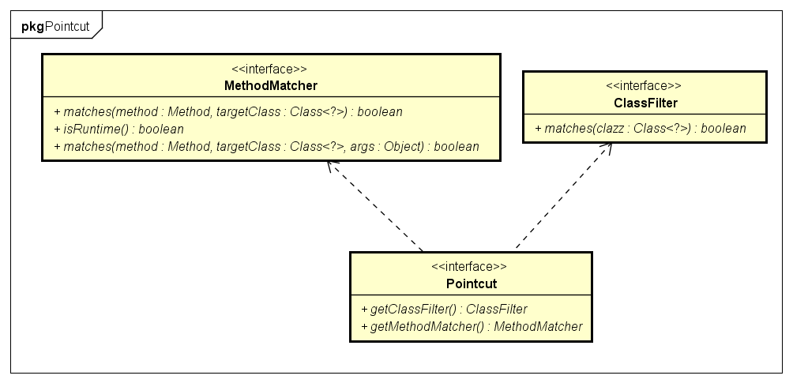
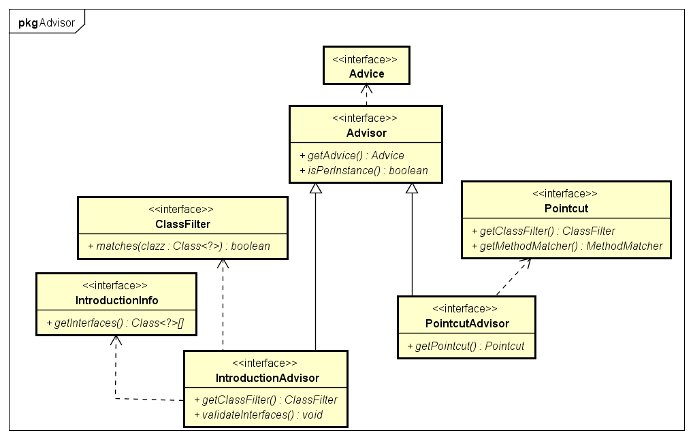

# 1 AOP
AOP (Aspect-Oriented Programming) 面向切面编程是OOP (Object-Oriented Programming)之外的另外一种编程思想。OOP编程的核心是类，而AOP编程的核心的切面，关注的是跨越多个类或对象的横切逻辑。  
AOP是Spring框架的重要组成，但IOC容器并不依赖它，可以把它当做一种功能强大的中间件使用。  
AOP在Spring中可以提供声明式的企业级服务用来代替EJB，例如最常见的声明式事务管理；此外还允许用户自定义切面来实现更多的功能。  

## 1.1 基本概念
- Join point: 程序执行中特定位置。例如方法执行前、执行后、抛出异常时等。  
- Advice：增强。在特定的连接点植入的额外程序逻辑，一般可以分为前置增强、后置增强、环绕增强等。技术实现上，一般采用拦截器链来实现。  
- Pointcut：切点。满足一定条件的连接点。Advice中包含了切点表达式，作用在满足该表达式的连接点上。Spring默认使用AspectJ 切点表达式。  
- Introduction：引介。为目标对象新增额外的属性或方法。  
- Aspect：切面。切面由Pointcut和Advice增强组成，既包括了横切逻辑的定义也包括了连接点的定义。Spring AOP的工作就是将（切面定义的）横切逻辑织入到（切面定义的）连接点中。  
- Target object：目标对象。被织入增强的普通对象。Spring AOP采用运行时代理，目标对象最终返回的是一个代理对象。  
- AOP proxy：AOP框架创建的目标对象的代理对象。一般基于JDK动态代理或CGLIB动态代理。  
- Weaving：将增强添加到目标对象指定连接点的过程。三种织入方式：编译期织入、类装载时织入、运行时织入。AspectJ采用的是编译期织入。  

增强类型：
- Before advice：前置增强。在目标方法执行前实施增强。  
- After returning advice：后置增强。在目标方法正确执行后实施增强。  
- After throwing advice：异常抛出增强。在目标方法抛出异常时实施增强。  
- After(finally) advice：finally增强。在目标方法执行后，不管是否抛出异常，实施增强。
- Around advice：环绕增强。在方法执行前和后实施增强。  

## 1.2 AOP的实现者
### 1.2.1 AspectJ
AspectJ是语言级的AOP实现，它扩展了Java语言，定义了AOP语法，能够在编译期提供横切代码的织入。所以它有一个专门的编译器用来生成遵守Java字节编码规范的Class文件。  
### 1.2.2 Spring AOP
Spring AOP使用纯Java实现，它不需要专门的编译过程，不需要特殊的类装载器，它在运行期通过代理方式向目标类织入增强代码，默认使用JDK动态代理技术，也支持CGLIB代理。Spring并不尝试提供最完整的AOP实现，相反，它侧重于提供一种和Spring IOC容器整合的AOP实现，用以解决企业级开发中的常见问题。在Spring中，我们可以无缝的将Spring AOP、IOC和AspectJ整合在一起。  

## 1.3 Spring AOP APIS
### 1.3.1 Advice 增强
Spring使用增强类定义横切逻辑。Spring只支持方法连接点，增强中包含了在方法的哪个点加入横切逻辑的方位信息。因此，Spring增强由横切逻辑和方法方位信息组成。  
按照增强作用在方法上的方位信息，增强可以分为以下5类：  
- 前置增强：在目标方法执行前实施增强。org.springframework.aop.BeforeAdvice代表前置增强，由于Spring目前只支持方法级别的增强，所以org.springframework.aop.MethodBeforeAdvice是目前可用的前置增强。  
- 后置增强：在目标方法执行后实施增强。org.springframework.aop.AfterReturningAdvice表示后置增强。  
- 环绕增强：在目标方法执行前和执行后实施增强。org.aopalliance.intercept.MethodInterceptor表示环绕增强。  
- 异常抛出增强：在目标方法抛出异常后实施增强。org.springframework.aop.ThrowsAdvice表示异常抛出增强。  
- 引介增强：在目标类中添加新的属性和方法。org.springframework.aop.IntroductionInterceptor表示引介增强。  


#### 1.3.1.1 前置增强
实现org.springframework.aop.MethodBeforeAdvice接口，添加前置增强逻辑。
```java
/**
* 自定义前置增强
*/
public class MyMethodBeforeAdvice implements MethodBeforeAdvice{
    @Override
    public void before(Method method, Object[] args, Object target) throws Throwable {
        System.out.println("MyBeforeAdvice>>" + target);
    }
}
```
```xml
<bean id="myBeforeAdvice"
		class="com.study.spring.core.aop.xml.advice.MyMethodBeforeAdvice" />

<bean id="barTarget" class="com.study.spring.core.aop.xml.BarServiceImpl" />
<bean id="barProxy" class="org.springframework.aop.framework.ProxyFactoryBean">
    <!-- 配置增强Bean的名称 -->
    <property name="interceptorNames" value="myBeforeAdvice" />
    <!-- 配置目标类 -->
    <property name="target" ref="barTarget" />
    <!-- 配置接口类，默认使用JDK动态代理 -->
    <property name="proxyInterfaces" value="com.study.spring.core.aop.xml.IBarService" />
    <!-- 强制使用cglib动态代理，下面配置二选一 -->
    <property name="proxyTargetClass" value="true" />
    <property name="optimize" value="true" />
</bean>
```
如上配置，自定义前置增强会实施到目标对象中的每个public方法上去。  

#### 1.3.1.2 后置增强
实现org.springframework.aop.AfterReturningAdvice接口，添加后置增强逻辑。当目标方法中有异常抛出时，后置增强将不会执行。  
#### 1.3.1.3 环绕增强
实现org.aopalliance.intercept.MethodInterceptor接口，添加环绕增强逻辑。需要在增强中主动调用目标方法：  
```java
public class MyMethodInterceptor implements MethodInterceptor {
    @Override
    public Object invoke(MethodInvocation invocation) throws Throwable {
        System.out.println("MyMethodInterceptor>>before");
        Object result = invocation.proceed();
        System.out.println("MyMethodInterceptor>>after");
        return result;
    }
}
```
#### 1.3.1.4 异常抛出增强
实现org.springframework.aop.ThrowsAdvice接口，添加在目标方法抛出异常时的增强逻辑。ThrowsAdvice接口没有定义任何方法，它是一个标识接口，在运行期Spring使用反射的机制自行判断，但是我们必须采用以下签名形式定义增强方法：  
```java
void afterThrowing([Method method, Object[] args, Object target,] Throwable exp)
```
方法名必须为afterThrowing，方法入参前三个分别为目标方法，目标方法参数和目标对象是可选的，而最后一个入参为异常对象，是必填的。例如：  
```java
afterThrowing(SQLException e);
afterThrowing(Method method, Object[] args, Object target, RuntimeException e);
```
#### 1.3.1.5 引介增强
引介增强是一种特殊的增强类型，它不是在目标方法周围织入增强，而是为目标类创建新的方法和属性，所以引介增强的连接点是类级别的而非方法级别。  
IntroductionInterceptor接口为引介增强接口，它是一个标识性接口，没有定义任何方法。Spring为该接口提供了DelegatingIntroductionInterceptor实现类，一般情况下继承该扩展类即可。  
```java
/**
* 自定义引介增强类，实现待新增的接口
*/
public class MyIntroductionAdvice extends DelegatingIntroductionInterceptor implements IServiceBar{
    @Override
    public void doBar() {
        System.out.println("call doBar()");
    }
}

@Test
public void test() throws IOException {
    ProxyFactory factory = new ProxyFactory();
    // 新建目标对象
    IServiceFoo target = new FooService();
    factory.setTarget(target);
    // 配置引介增强
    factory.addAdvice(new MyIntroductionAdvice());
    // 必须使用基于继承的代理方式
    factory.setProxyTargetClass(true);
    // 创建代理对象
    Object proxy = factory.getProxy();
    Assert.assertTrue(proxy instanceof IServiceFoo);
    ((IServiceFoo)proxy).doFoo();
    Assert.assertTrue(proxy instanceof IServiceBar);
    ((IServiceBar)proxy).doBar();
}
```
### 1.3.2 Pointcut 切点
上面介绍增强时，我们注意到一个问题：增强会被织入到目标对象的所有方法中，加入我们希望有选择的织入到目标类的某些特定的方法中时，就需要使用切点来定位目标连接点了。增强提供了连接点的方位信息，比如织入到方法执行前，执行后等，而切点更进一步描述织入到哪些类的哪些方法上去。  
Spring通过org.springframework.aop.Pointcut接口来描述切点信息：  
```java
public interface Pointcut {
	ClassFilter getClassFilter();
	MethodMatcher getMethodMatcher();
}
```

该接口包含两部分信息：ClassFilter用来定位特定的类，MethodMatcher用来定位特定的方法。因此，切点就拥有了织入到特定类的特定方法上的能力。  
Spring支持两种方法匹配器：静态方法匹配器和动态方法匹配器。静态方法匹配器是指仅对方法签名包括方法名、入参类型及顺序等进行匹配。而动态方法匹配器是在运行时检查方法入参的值。静态方法匹配只会判别一次，而动态方法匹配在每次方法调用时都会判别一下，影响性能。方法匹配器的类型有isRuntime()方法返回值决定，false代表静态匹配，true代表动态匹配。一般建议使用静态方法匹配，允许AOP框架缓存切点信息，提供运行效率。  

#### 1.3.2.1 切点类型
Spring提供了6种类型切点：  
- 静态方法切点：org.springframework.aop.support.StaticMethodMatcherPointcut是静态方法切点的抽象基类，默认情况下它匹配所有方法。两个主要的子类是：
    - NameMatchMethodPointcut：使用简单字符串匹配方法签名。
    - AbstractRegexpMethodPointcut：使用正则表达式匹配方法签名。
- 动态方法切点：org.springframework.aop.support.DynamicMethodMatcherPointcut是动态方法切点的抽象基类。
- 注解切点：org.springframework.aop.support.annotation.AnnotationMatchingPointcut支持在Bean中直接通过注解定义的切点。
- 表达式切点：org.springframework.aop.support.ExpressionPointcut主要是为了支持AspectJ切点表达式语法而定义的接口。
- 流程切点：org.springframework.aop.support.ControlFlowPointcut是一种特殊的切点，它根据程序执行堆栈的信息查看目标方法是否由某一个方法直接或间接发起调用，以此判断是否为匹配的连接点。
- 复合切点：org.springframework.aop.support.ComposablePointcut是为创建多个切点而提供的方便操作类。它所有的方法都返回ComposablePointcut类，这样就可以使用链式表达式对切点进行交叉或合并操作。

#### 1.3.3 Advisor 切面
Spring使用org.springframework.aop.Advisor接口表示切面的概念，一个切面同时包含增强逻辑和连接点信息。切面可以分为3类：一般切面、切点切面和引介切面：
- org.springframework.aop.Advisor：代表一般切面，它仅包含一个Advice。因为Advice包含了横切代码和连接点信息，所以Advice本身就是一个简单的切面，只不过它代表的横切的连接点是所有目标类的所有方法，因为太宽泛，所以一般不直接使用。
- org.springframework.aop.PointcutAdvisor：代表具有切点的切面，它包含Advice和Pointcut两个类。
- org.springframework.aop.IntroductionAdvisor：代表引介切面。引介切面是对应引介增强的特殊切面，它应用于类层面上，所以引介切点使用ClassFilter进行定义。


PointcutAdvisor主要有6个实现类：  
- org.springframework.aop.support.DefaultPointcutAdvisor：最常用的切面类型。它可以使用任意一个Advice和Pointcut定义切面，唯一不支持的是引介类型的切面。一般可以扩展该类实现自定义切面。 
- org.springframework.aop.support.NameMatchMethodPointcutAdvisor：通过该类可以定义按方法名称定义切点的切面。
- org.springframework.aop.support.RegexpMethodPointcutAdvisor：通过正则表达式匹配方法名定义切点的切面。
- org.springframework.aop.support.StaticMethodMatcherPointcutAdvisor：通过静态方法匹配定义切点的切面，匹配所有的目标类。
- org.springframework.aop.aspectj.AspectJExpressionPointcutAdvisor：用于AspectJ表达式定义切点的切面。
- org.springframework.aop.aspectj.AspectJPointcutAdvisor：用于AspectJ语法定义切点的切面。

引介切面接口IntroductionAdvisor同时继承Advisor和IntroductionInfo接口，IntroductionInfo描述了目标类需要实现的新的接口。IntroductionAdvisor不同于PointcutAdvisor，仅有一个类过滤器ClassFilter，没有MethodMatcher，因为引介切面的切点是类级别的，而Pointcut的切点是方法级别的。  
IntroductionAdvisor有两个实现类，分别是DefaultIntroductionAdvisor和DeclareParentsAdvisor。前者是引介切面最常用的实现类，后者用于实现使用AspectJ语言的DeclareParent注解表示的引介切面。  
DefaultIntroductionAdvisor拥有三个构造函数：  
- DefaultIntroductionAdvisor(Advice advice)：通过一个引介增强创建的引介切面，引介切面将会为目标对象新增增强对象中所有接口的实现。
- DefaultIntroductionAdvisor(DynamicIntroductionAdvice advice, Class clazz)：通过一个引介增强和一个指定的接口类创建引介切面，仅为目标对象新增clazz接口的实现。
- DefaultIntroductionAdvisor(Advice advice, IntroductionInfo introductionInfo)：通过一个引介增强和一个IntroductionInfo创建一个引介切面，目标对象需要实现哪些接口，由introductionInfo对象的getInterfaces()表示。

## 1.3 Spring切点表达式
## 1.3 基于XML配置的AOP
使用XML配置AOP需要将AOP相关的配置放在`<aop:config></aop:config>`标签内，包括切点、增强、切面等。可以配置多个`<aop:config />`。  
## 1.3.1 配置切面
使用`<aop:aspect />`标签配置切面。  
```xml
<aop:config>
    <aop:aspect id="myAspect" ref="aBean">
        ...
    </aop:aspect>
</aop:config>
```
## 1.3.2 配置切点
使用`<aop:pointcut />`标签配置切点。可以直接放在`<aop:config />`下，可供所有切面使用，也可以放在`<aop:aspect />`元素下，只为该切面服务。  

## 1.3.3 配置增强


## 1.4 基于@AspectJ配置的AOP
