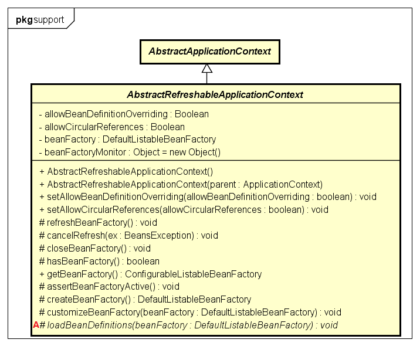

# Spring 源码解析
## 1 BeanFactory和ApplicationContext
BeanFactory是基本的IOC容器，提供Bean的获取和保存维护等基础功能。首先ApplicationContext就是一个BeanFactory，而且更高级。它除了提供基础的IOC容器功能外，还提供了一些高级的功能：
- 支持国际化信息（MessageSource）
- 资源访问能力（ResourceLoader）
- 注册事件监听（ApplicationEventPublisher）
- ...

### 1.1 BeanFactory
BeanFactory 顾名思义，是Spring保管Bean定义的工厂或容器。外部可以通过该接口获取所有被保管的单例或非单例的Bean。  

#### 1.1.1 BeanRegistry
谈到容器，就必然需要存储。BeanFactory的存储功能依赖于BeanRegistry。  

- AliasRegistry  简单的alias存储器，但一般作为BeanRegistry的顶层接口
	- SimpleAliasRegistry AliasRegistry的简单实现
- SingletonBeanRegistry 单实例bean存储器
	- DefaultSingletonBeanRegistry
- FactoryBeanRegistrySupport 可以管理FactoryBean的存储器
*注意：* BeanFactory与FactoryBean的区别  

#### 1.1.2 HierarchicalBeanFactory
HierarchicalBeanFactory是BeanFactory的子接口。Hierarchical，分层的，多级的，即HierarchicalBeanFactory的引入可以将整个Bean容器分层，child-parent BeanFactory的形式，便于同级之间、上下级之间资源的共享与隔离。

#### 1.1.3 ListableBeanFactory
ListableBeanFactory是BeanFactory的子接口。提供了额外的可罗列所有指定规格的Bean实例的方法，比起每次通过BeanName一个一个获取Bean的方式，功能更加强大。

### 1.2 ApplicationContext
ApplicationContext是Spring的核心，通过继承多个功能接口为整个应用程序提供全面的服务支持。
- 继承ListableBeanFactory接口，获得访问Bean容器的能力
- 继承HierarchicalBeanFactory接口，获得容器分层的能力
- 继承ResourceLoader接口，获得访问资源文件的能力
- 继承ApplicationEventPublisher接口，获得注册事件监听的能力
- 继承MessageSource接口，获得提供国际化信息的能力

#### 1.2.1 ConfigurableApplicationContext
ConfigurableApplicationContext是ApplicationContext的子接口，此外还继承了Lifecycle, Closeable两个接口。提供了配置Application Context信息的基本方法，规范了Application Context启动和停止的过程。实际中，应避免直接使用ApplicationContext接口中的方法配置Context。

#### 1.2.2 AbstractApplicationContext
作为ApplicationContext接口的抽象实现，仅仅实现了容器基本的方法，包括getBean等，但Bean的配置和创建方式还需要子类实现抽象方法来实现。此外，该类还会自动注册一些特殊的Bean，BeanFactoryPostProcessors, BeanPostProcessors和ApplicationListeners。

#### 1.2.3 AbstractRefreshableApplicationContext
ApplicationContext的基本实现类，每次AbstractApplicationContext.refresh()方法被调用时，都会创建一个BeanFactory实例。唯一需要子类实现的是loadBeanDefinitions方法，用来加载Bean的配置。

#### 1.2.4 AbstractRefreshableConfigApplicationContext
AbstractRefreshableApplicationContext的抽象子类，添加了处理特定位置配置的功能，并且作为基于XML配置的ApplicationContext实现的基础父类。  
- Aware：标识型接口，标识Bean可被Spring容器通过回调方法通知到。一般回调方法为单参数的无返回值得方法。
- BeanNameAware：Bean在BeanFactory中的名称
- InitializingBean：当BeanFactory配置完所有的Properties时调用该接口方法，可用于自定义检查，例如检查一些必要属性是否存在等。可使用init-method注解完成该接口的工作。  

#### 1.2.5 AbstractXmlApplicationContext
使在XML中定义的Bean能够被XmlBeanDefinitionReader识别、加载。子类只需要实现getConfigResources或getConfigLocations方法接口，告知配置文件的路径。  

#### 1.2.6 ClassPathXmlApplicationContext

