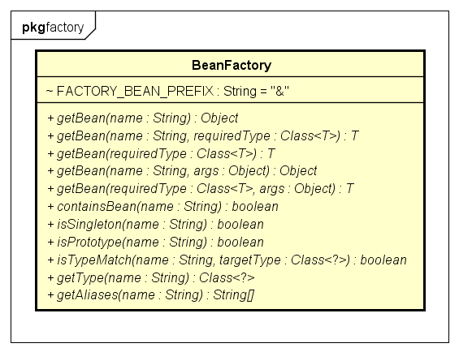

# Spring 源码解析
## 1 BeanFactory和ApplicationContext
### 1.1 BeanFactory
BeanFactory 顾名思义，是Spring保管Bean定义的工厂或容器。外部可以通过该接口获取所有被保管的单例或非单例的Bean。  

#### 1.1.1 HierarchicalBeanFactory
HierarchicalBeanFactory是BeanFactory的子接口。Hierarchical，分层的，多级的，即HierarchicalBeanFactory的引入可以将整个Bean容器分层，child-parent BeanFactory。

#### 1.1.2 ListableBeanFactory
ListableBeanFactory是BeanFactory的子接口。提供了额外的可罗列所有指定规格的Bean实例的方法，比起每次通过BeanName一个一个获取Bean的方式，功能更加强大。

