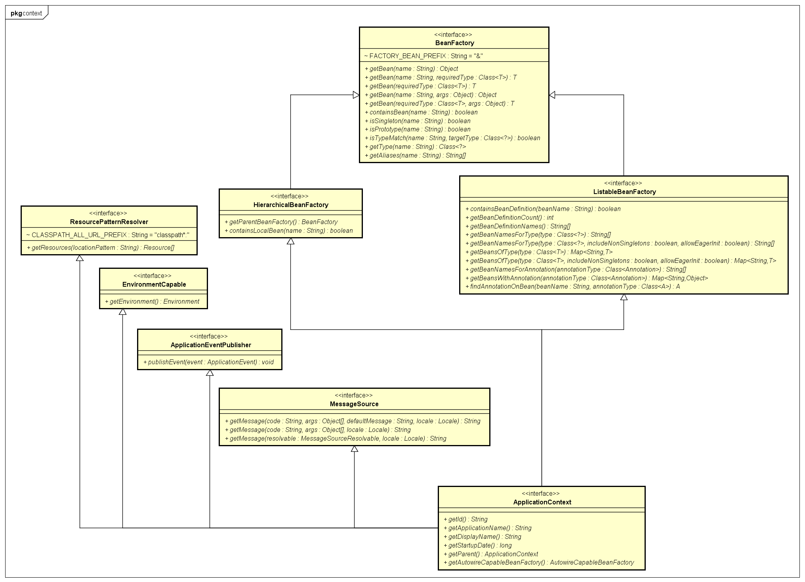

# Spring 源码解析
## 1 BeanFactory和ApplicationContext
### 1.1 BeanFactory
BeanFactory 顾名思义，是Spring保管Bean定义的工厂或容器。外部可以通过该接口获取所有被保管的单例或非单例的Bean。  

#### 1.1.1 HierarchicalBeanFactory
HierarchicalBeanFactory是BeanFactory的子接口。Hierarchical，分层的，多级的，即HierarchicalBeanFactory的引入可以将整个Bean容器分层，child-parent BeanFactory的形式，便于同级之间、上下级之间资源的共享与隔离。

#### 1.1.2 ListableBeanFactory
ListableBeanFactory是BeanFactory的子接口。提供了额外的可罗列所有指定规格的Bean实例的方法，比起每次通过BeanName一个一个获取Bean的方式，功能更加强大。

### 1.2 ApplicationContext
ApplicationContext是Spring的核心，通过继承多个功能接口为整个应用程序提供全面的服务支持。
- 继承ListableBeanFactory接口，获得访问Bean容器的能力
- 继承HierarchicalBeanFactory接口，获得容器分层的能力
- 继承ResourceLoader接口，获得访问资源文件的能力
- 继承ApplicationEventPublisher接口，获得注册事件监听的能力
- 继承MessageSource接口，获得提供国际化信息的能力

#### 1.2.1 ConfigurableApplicationContext
ConfigurableApplicationContext是ApplicationContext的子接口，此外还继承了Lifecycle, Closeable两个接口。提供了配置Application Context信息的基本方法，规范了Application Context启动和停止的过程。实际中，应避免直接使用ApplicationContext接口中的方法配置Context。

#### 1.2.2 AbstractApplicationContext
#### 1.2.3 AbstractRefreshableConfigApplicationContext
#### 1.2.4 AbstractXmlApplicationContext
#### 1.2.5 ClassPathXmlApplicationContext